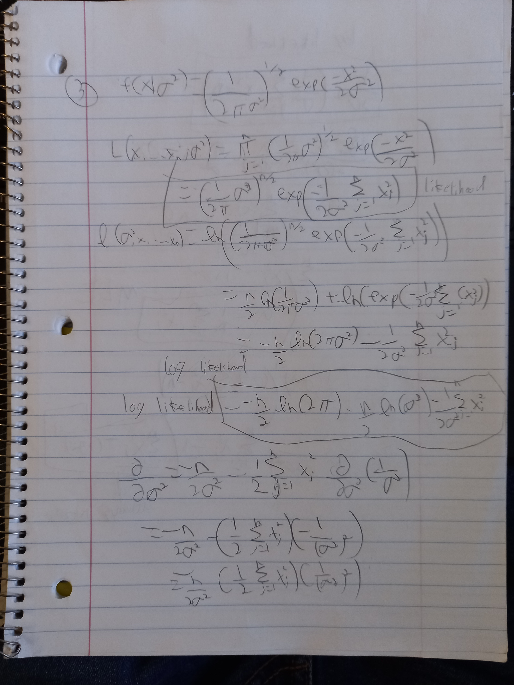

Here you will practice what you learned in the maximum likelihood estimation. Please turn this in as an RMarkdown document. You can either add your solution in Latex or you can write it by hand and input a scanned version or picture into the R Markdown. 'Turn it in' by uploading to your GitHub repository. 

\begin{enumerate}
\item (20 points) Suppose ${\bf x}=(x_1,\ldots, x_N)^T$ follow a Poisson distribution with a parameter $\lambda>0$ and p.m.f. given by 
$$P(x=k|\lambda)=\frac{\lambda^k e^{-\lambda}}{k!}.$$
Answer the following questions:
    \begin{enumerate}
    \item Using {\bf ggplot}, plot the Poisson pmf for $k=0,1,\ldots,10$ when $\lambda=5$. 
```{r}
library(tidyverse)
k <- 0:10
pos_dist <- tibble(k,"poisson" = dpois(k, lambda=5))


ggplot(data = pos_dist, aes(x = k, y = poisson)) + 
  geom_line()
```
    \item Asummining ${\bf x}$ is observed, give the likelihood $L(\lambda|{\bf x})$ and log-likelihood $l(\lambda|{\bf x})$ functions.
    \item Find the Maximum Likelihood Estimator (MLE) $\hat\lambda$ for $\lambda$.
    \item Show that your estimator is in fact a maximum: i.e., check the boundary values of the log-likelihood, and check that the second derivative of the log-likelihood is zero everywhere.

    \end{enumerate}

\item (20 points) Suppose ${\bf x}=(x_1,\ldots, x_N)^T$ are $iid$ random variables with p.d.f. given by
$$f(x|\theta)=\theta x^{\theta-1},\ 0\le x\le 1,\ 0<\theta<\infty.$$
    \begin{enumerate}
    \item Using {\bf ggplot}, plot the pdf for an individual $x_i$ given $\theta=0.5$ and also for $\theta=5$. 
```{r}
newDist <- function(th, x){th*x^(th-1)}
k = 0:10
new_dist <- tibble(k,"Value" = newDist(th = .5, k))


ggplot(data = new_dist, aes(x = k, y = Value)) + 
  geom_line()
```
```{r}
 newDist <- function(th, x){th*x^(th-1)}
k = 0:10
new_dist <- tibble(k,"Value" = newDist(th = 5, k))


ggplot(data = new_dist, aes(x = k, y = Value)) + 
  geom_line()  
```
   
    \item Give the likelihood $L(\theta|{\bf x})$ and log-likelihood $l(\theta|{\bf x})$ functions.
    \item Find the Maximum Likelihood Estimator (MLE) $\hat\theta$ for $\theta$.
    \item Show that your estimator is in fact a maximum: i.e., check the boundary values of the log-likelihood, and check that the second derivative of the log-likelihood is zero everywhere.
    

    \end{enumerate}

\item (20 points) Suppose ${\bf x}=(x_1,\ldots, x_N)^T$ are $iid$ random variables from a $Normal(0,\sigma^2)$ distribution. The pdf is given by
$$f(x|\sigma^2)=\left(\frac{1}{2\pi\sigma^2}\right)^{1/2}e^{-\frac{x^2}{2\sigma^2}},\ -\infty < x < \infty,\ \sigma^2>0.$$
Find the Maximum Likelihood Estimator (MLE) $\hat\sigma^2$ for $\sigma^2$. Is it what you thought it would be? Why or why not?


I guess I'm not surprised that the MLE for variance is the sample variance.
That kind of makes sense since the futher you get from the sample variance
the less likely it is to be the true variance.
   
\end{enumerate}
